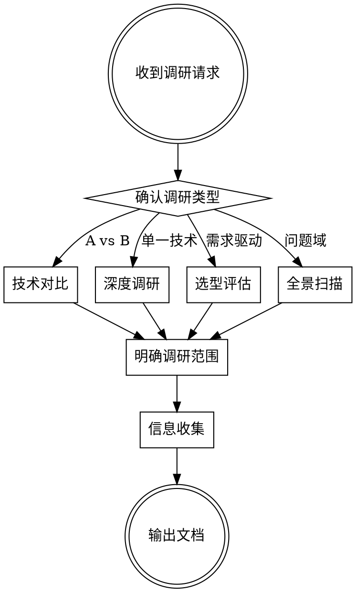

# 技术调研 Skill

系统化完成技术调研，输出结构化中文文档。

## 工作流程



## Step 1: 确认调研类型

用 AskQuestion 工具向用户确认调研模式：

| 模式 | 适用场景 | 示例 |
|------|----------|------|
| **技术对比** | 两项或多项技术横向对比 | MySQL vs TDSQL、React vs Vue |
| **深度调研** | 单一技术的原理/架构/使用方式 | 深入研究 ClickHouse 架构 |
| **选型评估** | 面向具体需求，评估技术是否适合引入 | 我们该不该用 Kafka？ |
| **全景扫描** | 某个问题域有哪些可选方案 | 消息队列有哪些选择？ |

如果用户的请求已经明确暗示了类型（如"A 和 B 哪个好"显然是技术对比），可以跳过确认直接进入下一步。

## Step 2: 明确调研范围

向用户确认以下信息（已知的可跳过）：

- **调研主题**：具体技术名称或问题域
- **覆盖维度**：从以下常见维度中选择（默认全选）：
  - 架构与原理、性能与基准、功能特性、安全性、
  - 部署与运维、社区与生态、成本、学习曲线、适用场景
- **调研深度**：快速概览（1-2页）vs 深度分析（完整报告）
- **特殊关注点**：用户是否有特别关心的方面

## Step 3: 信息收集

使用 WebSearch 和 WebFetch 工具系统收集信息：

**搜索策略**：
1. 搜索官方文档和 GitHub 仓库，获取最新版本、架构信息
2. 搜索技术博客和行业分析文章，获取实践经验
3. 搜索 benchmark 数据和性能对比
4. 搜索已知问题、安全公告、CVE
5. 搜索社区讨论（Stack Overflow、Reddit、知乎等）

**搜索时注意**：
- 优先使用当前年份限定搜索结果，确保信息时效性
- 中英文关键词都要搜索，扩大信息覆盖面
- 对关键数据进行交叉验证，不依赖单一来源

## Step 4: 输出文档

根据调研类型选择对应模板，生成文档保存到 `docs/` 目录。

**文件命名**：`docs/<topic>.md`
- 技术对比：`docs/<techA>-vs-<techB>.md`
- 深度调研：`docs/<tech>-deep-dive.md`
- 选型评估：`docs/<tech>-evaluation.md`
- 全景扫描：`docs/<domain>-landscape.md`

### 通用文档头格式

每篇文档必须包含：

```markdown
# 标题

> 更新时间：YYYY-MM-DD
> 数据来源：列出主要参考来源（官方文档、博客文章、研究报告等）

---
```

### 模板 A: 技术对比

```markdown
# [技术A] vs [技术B] 深度对比

> 更新时间 / 数据来源

---

## 目录
（自动生成，包含所有一级和二级标题）

## 1. 项目概述
- 一句话定位对比表（表格）
- 核心差异的简要描述（2-3 段）

## 2. 基本信息
| 维度 | 技术A | 技术B |
|------|-------|-------|
| 开发方 | | |
| 首次发布 | | |
| 最新版本 | | |
| 许可证 | | |
| 编程语言 | | |
| GitHub Stars | | |
| 官网 | | |

## 3-N. 各维度详细对比
每个维度包含：
- 各技术的详细说明（文字 + 架构图）
- 维度对比表（表格）
- 核心差异点总结（一句话）

## N+1. 适用场景
### 选择 [技术A] 当你需要：
- 场景列表

### 选择 [技术B] 当你需要：
- 场景列表

## N+2. 综合对比速查表
| 对比维度 | 技术A | 技术B |
|----------|-------|-------|
（所有维度的一行式汇总）
```

### 模板 B: 深度调研

```markdown
# [技术名称] 深度调研

> 更新时间 / 数据来源

---

## 1. 概述与背景
- 是什么、解决什么问题、诞生背景

## 2. 核心架构与原理
- 整体架构图（文本格式）
- 关键组件说明
- 数据流 / 工作原理

## 3. 关键特性详解
- 每个特性：是什么、怎么用、适用场景

## 4. 性能与基准测试
- 官方 / 第三方 benchmark 数据
- 性能特点与瓶颈

## 5. 部署与运维
- 部署方式、运维要求、监控方案

## 6. 生态与社区
- 社区活跃度、周边工具、学习资源

## 7. 优劣势总结
| 优势 | 劣势 |
|------|------|

## 8. 适用场景与建议
- 推荐使用的场景
- 不推荐的场景
- 注意事项
```

### 模板 C: 选型评估

```markdown
# [技术/方案] 选型评估

> 更新时间 / 数据来源

---

## 1. 需求背景与评估目标
- 业务场景描述
- 核心需求列表
- 评估目标

## 2. 候选方案概览
| 方案 | 一句话描述 | 适用定位 |
|------|-----------|----------|

## 3. 评估维度与权重
| 维度 | 权重 | 说明 |
|------|------|------|

## 4. 逐项评估
### 4.1 [方案A]
每个维度的评估 + 评分

### 4.2 [方案B]
...

## 5. 评估汇总
| 维度 | 方案A | 方案B | ... |
|------|-------|-------|-----|
（评分矩阵）

## 6. 风险分析
| 方案 | 主要风险 | 缓解措施 |
|------|----------|----------|

## 7. 结论与推荐
- 推荐方案及理由
- 实施建议
- 后续跟进事项
```

### 模板 D: 全景扫描

```markdown
# [问题域] 技术全景扫描

> 更新时间 / 数据来源

---

## 1. 问题域描述
- 要解决的核心问题
- 关键需求特征

## 2. 方案分类概览
| 分类 | 代表方案 | 核心思路 |
|------|----------|----------|

## 3. 各方案简介
### 3.1 [方案名]
（每个方案 100-200 字简介：是什么、核心特点、适用场景）

## 4. 特性对比矩阵
| 特性 | 方案A | 方案B | 方案C | ... |
|------|-------|-------|-------|-----|

## 5. 推荐路径
按不同场景给出推荐选择路径：
- 如果你需要 X → 推荐 A
- 如果你需要 Y → 推荐 B
```

## 文档风格要求

- **语言**：默认中文
- **善用表格**：对比信息优先用 markdown 表格，清晰直观
- **架构图**：用文本流程图表示，保持纯文本可读性
- **数据来源**：所有关键数据标注来源和时间
- **客观中立**：陈述事实，避免主观偏见；推荐部分基于场景而非绝对优劣
- **时效性**：标注文档更新时间，提醒读者注意数据可能过时
