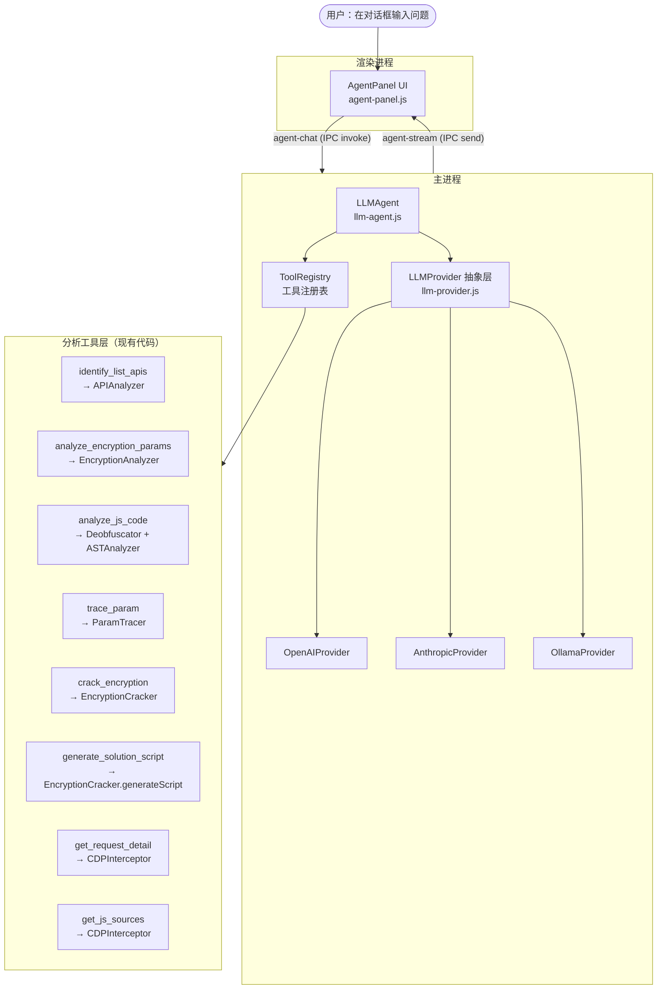
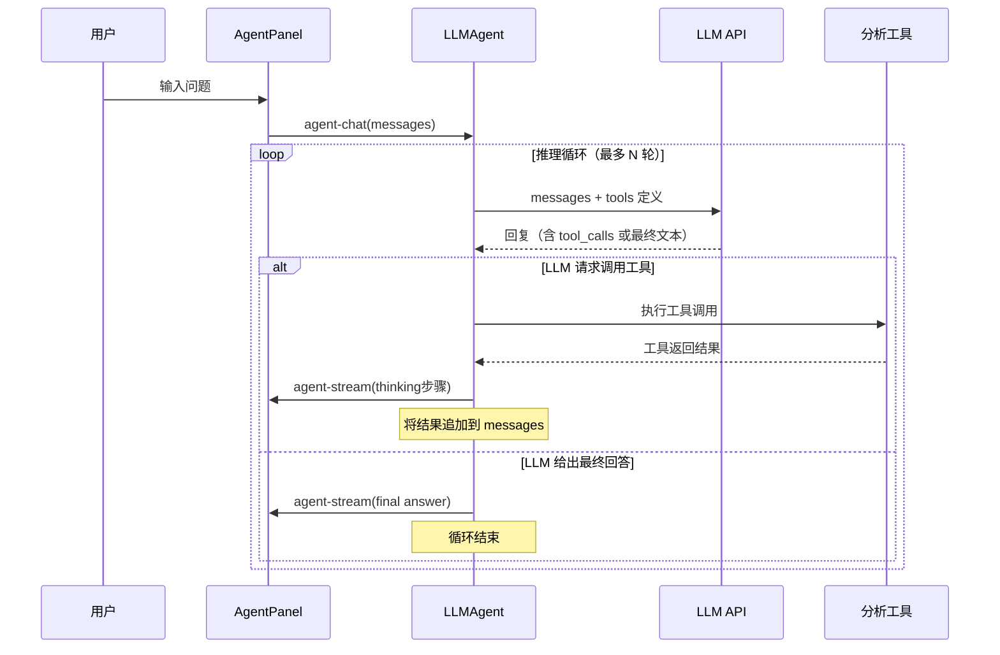

# Auto Reverser — Agent 大模型智能分析功能文档

> 版本：v2.0  
> 更新：2026-03-30  
> 状态：设计规范（待实现）

---

## 一、功能概述

### 1.1 背景与目标

现有工具已实现实时 CDP 网络请求捕获和手动查看请求详情，但识别"哪个接口是列表数据来源"以及"参数如何加密"仍依赖用户经验。

**Agent 功能**引入大语言模型（LLM）作为核心推理引擎，以 **Tool Calling（工具调用）** 模式驱动分析：LLM 不是被动地接受一批数据进行单次总结，而是**主动决策**调用哪些分析工具、以什么顺序、带什么参数，在多轮交互中逐步完成推理，最终给出可执行的解密方案。

**整体目标**：用户完成浏览捕获后，输入一个自然语言问题（如"分析这个页面的列表接口并告诉我签名如何生成"），Agent 自主完成从请求筛选、加密检测到代码生成的全链路，并以对话形式呈现推理过程和结果。

### 1.2 与手动模式的对比

| 能力 | 现有手动模式 | LLM Agent 模式 |
|------|------------|---------------|
| 数据接口识别 | 用户逐条查看 | LLM 调用 `identify_list_apis` 工具自动筛选 |
| 加密参数标记 | 仅显示 🔐 徽标（未接通） | LLM 调用 `analyze_encryption_params` 全量扫描 |
| 分析策略决定 | 人工判断 | LLM 根据上下文自主决定下一步调用哪个工具 |
| JS 源码溯源 | 不支持 | LLM 调用 `analyze_js_code` + `trace_param` 工具 |
| 解密脚本生成 | 不支持 | LLM 调用 `generate_solution_script` 工具并自动解释 |
| 多轮追问 | 不支持 | 用户可在对话框中继续追问，Agent 保持上下文 |
| 不确定时处理 | 无 | LLM 标注置信度，主动说明局限，请求用户补充信息 |

### 1.3 支持的模型提供商

| 提供商 | 代表模型 | 接入方式 | 需要网络 |
|--------|---------|---------|---------|
| OpenAI | GPT-4o、GPT-4-turbo | API Key | 是 |
| Anthropic | Claude 3.5 Sonnet、Claude 3 Haiku | API Key | 是 |
| Ollama | llama3、qwen2.5、deepseek-coder 等 | 本地端口 | 否 |

所有提供商通过统一的 `LLMProvider` 抽象层对接，上层 Agent 逻辑无需关心具体模型差异。

---

## 二、LLM Agent 架构

### 2.1 整体架构图



### 2.2 Tool Calling 推理循环

LLM Agent 采用标准的 **ReAct（Reasoning + Acting）** 循环：



**循环终止条件**：
- LLM 回复中不再包含 `tool_calls`（给出最终文本答案）
- 达到最大轮数上限（默认 10 轮，可配置）
- 用户手动中止

---

## 三、分析工具定义（Tool Schema）

每个工具均以 JSON Schema 格式声明，通过 `ToolRegistry` 统一注册，在调用 LLM API 时作为 `tools` 参数传入。

### 3.1 `identify_list_apis`

**作用**：从所有已捕获请求中识别列表型数据接口，按置信度排序。

```json
{
    "name": "identify_list_apis",
    "description": "扫描所有已捕获的网络请求，识别返回列表型数据（数组、分页）的 API 接口，按置信度评分排序返回候选列表。应在分析开始时首先调用此工具。",
    "parameters": {
        "type": "object",
        "properties": {
            "min_confidence": {
                "type": "number",
                "description": "最低置信度过滤阈值，0-100，默认 30",
                "default": 30
            },
            "limit": {
                "type": "integer",
                "description": "最多返回几条候选接口，默认 10",
                "default": 10
            }
        }
    }
}
```

**返回值**：`CandidateAPI[]`（见第五章数据结构）

**底层实现**：调用 `APIAnalyzer.findListAPI(requests)`

### 3.2 `analyze_encryption_params`

**作用**：对指定接口的请求参数进行加密检测。

```json
{
    "name": "analyze_encryption_params",
    "description": "分析指定请求的 Query 参数、POST Body 和关键 Headers 中是否存在加密或签名参数，识别加密类型（MD5/SHA/JWT/Base64/AES 等）。在识别到候选接口后调用此工具。",
    "parameters": {
        "type": "object",
        "properties": {
            "request_id": {
                "type": "string",
                "description": "要分析的请求 ID（来自 identify_list_apis 的返回值）"
            }
        },
        "required": ["request_id"]
    }
}
```

**返回值**：`{ encryptedParams, suspiciousParams, combinations }`

**底层实现**：调用 `EncryptionAnalyzer.analyze(params)`

### 3.3 `get_request_detail`

**作用**：获取单条请求的完整信息（URL、方法、请求头、请求体、响应体）。

```json
{
    "name": "get_request_detail",
    "description": "获取指定请求 ID 的完整请求和响应详情，包括 Headers、Body、响应体 JSON 结构。用于进一步了解某个具体接口。",
    "parameters": {
        "type": "object",
        "properties": {
            "request_id": {
                "type": "string",
                "description": "请求 ID"
            }
        },
        "required": ["request_id"]
    }
}
```

**底层实现**：调用 `CDPInterceptor.getRequest(requestId)`

### 3.4 `get_js_sources`

**作用**：列举页面已捕获的所有 JS 文件 URL，供后续源码分析使用。

```json
{
    "name": "get_js_sources",
    "description": "返回本次会话中已捕获的所有 JavaScript 文件列表（URL + 大小），用于选择哪些 JS 文件值得进行源码分析。",
    "parameters": {
        "type": "object",
        "properties": {}
    }
}
```

**返回值**：`Array<{ requestId, url, size }>`

**底层实现**：从 `CDPInterceptor.getAllRequests()` 过滤 `resourceType === 'javascript'`

### 3.5 `analyze_js_code`

**作用**：对指定 JS 文件进行反混淆 + AST 解析，提取加密函数和 API 调用。

```json
{
    "name": "analyze_js_code",
    "description": "对指定 JS 文件进行反混淆处理，然后通过 AST 解析提取其中的加密函数、哈希调用和 API 请求代码。适合在找到可疑 JS 文件时使用。",
    "parameters": {
        "type": "object",
        "properties": {
            "request_id": {
                "type": "string",
                "description": "JS 文件对应的请求 ID（来自 get_js_sources）"
            }
        },
        "required": ["request_id"]
    }
}
```

**返回值**：`{ encryptionFunctions, apiCalls, callGraph, deobfuscatedSnippet }`

**底层实现**：`Deobfuscator.deobfuscate()` + `ASTAnalyzer.analyze()`

### 3.6 `trace_param`

**作用**：在 JS 调用图中追溯某个参数名的赋值路径，找到加密函数调用链。

```json
{
    "name": "trace_param",
    "description": "在已分析的 JS 调用图中，追踪某个加密参数的赋值路径，找出哪个函数最终生成了这个参数的值，以及完整的调用链。需要先调用 analyze_js_code 获得调用图。",
    "parameters": {
        "type": "object",
        "properties": {
            "param_name": {
                "type": "string",
                "description": "要追踪的参数名，如 'sign'、'token'"
            },
            "js_request_id": {
                "type": "string",
                "description": "来源 JS 文件的请求 ID"
            }
        },
        "required": ["param_name", "js_request_id"]
    }
}
```

**返回值**：`{ callPath, functionCode, confidence }`

**底层实现**：新增 `ParamTracer.trace(paramName, callGraph, encryptionFunctions)`

### 3.7 `crack_encryption`

**作用**：对特定加密值尝试多种破解策略。

```json
{
    "name": "crack_encryption",
    "description": "对已知加密类型的参数值尝试破解，包括 Base64 解码、MD5 字典碰撞、JWT 弱密钥破解、AES 已知密钥解密等。",
    "parameters": {
        "type": "object",
        "properties": {
            "encrypted_value": {
                "type": "string",
                "description": "加密后的参数值"
            },
            "encryption_type": {
                "type": "string",
                "enum": ["Base64", "MD5", "SHA1", "SHA256", "JWT", "AES", "auto"],
                "description": "加密类型，auto 表示自动尝试所有方法"
            },
            "context_params": {
                "type": "object",
                "description": "同一请求中的其他参数，用于 MD5 参数组合碰撞"
            }
        },
        "required": ["encrypted_value", "encryption_type"]
    }
}
```

**返回值**：`{ success, decrypted, method }`

**底层实现**：`EncryptionCracker.crack(value, type, { params })`

### 3.8 `generate_solution_script`

**作用**：根据分析结论生成可执行的签名复现代码。

```json
{
    "name": "generate_solution_script",
    "description": "根据已确定的加密类型和参数信息，生成 Python 和 Node.js 格式的签名复现脚本，包含使用示例。这是分析流程的最后一步。",
    "parameters": {
        "type": "object",
        "properties": {
            "encryption_type": {
                "type": "string",
                "description": "加密类型"
            },
            "params": {
                "type": "object",
                "description": "请求参数键值对，作为脚本中的示例数据"
            },
            "secret": {
                "type": "string",
                "description": "若已破解出密钥，在此传入"
            }
        },
        "required": ["encryption_type", "params"]
    }
}
```

**返回值**：`{ python, nodejs }`

**底层实现**：`EncryptionCracker.generateScript(type, data)`

---

## 四、LLM 提供商抽象层

### 4.1 `LLMProvider` 统一接口

```js
// src/core/llm-provider.js
class LLMProvider {
    /**
     * @param {object} config  - 提供商配置（apiKey、model、baseUrl 等）
     */
    constructor(config) {}

    /**
     * 发送一轮对话请求（支持 tool_calls）
     * @param {Message[]} messages   - 对话历史
     * @param {Tool[]}    tools      - 工具定义列表
     * @returns {LLMResponse}
     */
    async chat(messages, tools) {}

    /**
     * 验证 API Key / 连通性
     * @returns {boolean}
     */
    async verify() {}
}
```

`LLMResponse` 结构：

```js
{
    content:    string | null,    // 文本回复（最终答案）
    tool_calls: Array<{           // 工具调用请求（可为空数组）
        id:       string,
        name:     string,
        arguments: object
    }>,
    usage: {
        prompt_tokens:     number,
        completion_tokens: number
    }
}
```

### 4.2 各提供商实现

#### OpenAI Provider（`src/core/providers/openai-provider.js`）

- 使用 `openai` npm 包（需新增依赖）
- 调用 `client.chat.completions.create` 接口
- `tools` 格式：`{ type: 'function', function: { name, description, parameters } }`
- 工具调用结果通过 `role: 'tool'` 追加到 `messages`

#### Anthropic Provider（`src/core/providers/anthropic-provider.js`）

- 使用 `@anthropic-ai/sdk` npm 包（需新增依赖）
- 调用 `client.messages.create` 接口
- `tools` 格式与 OpenAI 相近，`tool_use` / `tool_result` 消息类型
- 需要在 `LLMProvider` 层做消息格式转换，统一暴露相同接口

#### Ollama Provider（`src/core/providers/ollama-provider.js`）

- 直接通过 `fetch` 调用本地 `http://localhost:11434/api/chat`
- 使用 Ollama 的 `tools` 字段（v0.3+ 支持 tool calling）
- 若模型不支持 tool calling，回退到 Prompt 注入模式（将工具定义以系统提示形式描述）

### 4.3 提供商选择逻辑

```js
// src/core/llm-provider-factory.js
function createProvider(config) {
    switch (config.provider) {
        case 'openai':     return new OpenAIProvider(config);
        case 'anthropic':  return new AnthropicProvider(config);
        case 'ollama':     return new OllamaProvider(config);
        default:           throw new Error(`Unknown provider: ${config.provider}`);
    }
}
```

---

## 五、LLM Agent 核心逻辑

### 5.1 `LLMAgent` 类（`src/core/llm-agent.js`）

```js
class LLMAgent {
    constructor(provider, toolRegistry, cdpInterceptor, streamCallback) {}

    /**
     * 处理一条用户消息，执行推理循环，流式推送过程
     * @param {string}   userMessage  - 用户输入
     * @param {Message[]} history     - 历史对话（可选）
     * @returns {AgentResponse}
     */
    async chat(userMessage, history = []) {}

    /**
     * 中止当前推理循环
     */
    stop() {}

    // 内部方法：执行单次 LLM 调用
    async _callLLM(messages) {}

    // 内部方法：执行单个工具调用
    async _executeTool(toolCall) {}

    // 内部方法：将工具结果格式化为 LLM 可读的摘要
    _formatToolResult(toolName, result) {}
}
```

### 5.2 系统提示词（System Prompt）

```
你是一个专业的 API 逆向分析助手，运行在 Auto Reverser 工具中。
用户已通过内嵌浏览器捕获了目标网站的网络请求，你的任务是帮助分析：
1. 哪个接口是列表页数据的来源
2. 该接口的请求参数中是否存在加密或签名
3. 加密逻辑是什么，如何复现

你拥有以下工具可以调用：
- identify_list_apis：扫描已捕获请求，识别列表接口
- analyze_encryption_params：分析指定接口的加密参数
- get_request_detail：获取完整请求详情
- get_js_sources：列举已捕获的 JS 文件
- analyze_js_code：对 JS 文件进行反混淆和 AST 分析
- trace_param：在调用图中追踪参数赋值路径
- crack_encryption：尝试破解加密值
- generate_solution_script：生成签名复现代码

分析策略：
1. 先调用 identify_list_apis 获取候选接口，从高置信度接口开始
2. 对候选接口调用 analyze_encryption_params 检测加密参数
3. 若发现加密参数，调用 get_js_sources + analyze_js_code 寻找相关 JS 文件
4. 对可疑 JS 文件调用 trace_param 追踪参数赋值链
5. 根据分析结果调用 crack_encryption 尝试破解，最后 generate_solution_script 生成代码

注意事项：
- 若分析结果不确定，主动说明置信度和局限性
- 若无法确定加密算法，输出你推断的最可能方案并说明依据
- 对工具返回的原始数据进行解读，用自然语言向用户解释发现
- 每次工具调用前简短说明你为什么要调这个工具
```

### 5.3 推理循环实现

```js
async chat(userMessage, history = []) {
    const MAX_ROUNDS = 10;
    const messages = [
        { role: 'system', content: SYSTEM_PROMPT },
        ...history,
        { role: 'user', content: userMessage }
    ];

    for (let round = 0; round < MAX_ROUNDS; round++) {
        if (this._stopped) break;

        const response = await this._callLLM(messages);

        // 流式推送 LLM 的思考文本（如果有）
        if (response.content) {
            this.streamCallback({ type: 'text', content: response.content });
        }

        // 若无工具调用，推理结束
        if (!response.tool_calls || response.tool_calls.length === 0) break;

        // 执行所有工具调用（并行）
        const toolResults = await Promise.all(
            response.tool_calls.map(tc => this._executeTool(tc))
        );

        // 推送工具执行步骤给 UI
        for (const result of toolResults) {
            this.streamCallback({ type: 'tool_step', ...result });
        }

        // 将 assistant 回复和工具结果追加到对话历史
        messages.push({ role: 'assistant', content: response.content, tool_calls: response.tool_calls });
        for (const result of toolResults) {
            messages.push({
                role: 'tool',
                tool_call_id: result.toolCallId,
                content: JSON.stringify(result.result)
            });
        }
    }
}
```

---

## 六、数据结构规范

### 6.1 `Message`（对话消息）

```js
{
    role:         'system' | 'user' | 'assistant' | 'tool',
    content:      string,
    tool_calls?:  ToolCall[],   // 仅 role=assistant 时存在
    tool_call_id?: string       // 仅 role=tool 时存在
}
```

### 6.2 `AgentStreamEvent`（流式推送事件）

```js
// 类型一：LLM 文本输出（思考 / 最终答案）
{ type: 'text', content: string }

// 类型二：工具调用步骤
{
    type:       'tool_step',
    toolName:   string,
    toolCallId: string,
    input:      object,    // 工具调用参数
    result:     object,    // 工具返回值（摘要）
    elapsed_ms: number
}

// 类型三：推理循环结束
{ type: 'done', rounds: number, totalTokens: number }

// 类型四：错误
{ type: 'error', message: string }
```

### 6.3 `CandidateAPI`（候选接口）

```js
{
    id:            string,
    url:           string,
    method:        string,
    apiType:       'list' | 'read' | 'graphql' | 'auth' | ...,
    confidence:    number,       // 0–100
    params: {
        queryParams: object,
        bodyParams:  object,
        headers:     object
    },
    dataStructure: {
        isArray:       boolean,
        itemCount:     number,
        hasPagination: boolean,
        paginationInfo: object | null,
        fields:        Array<{ name, path, type }>
    }
}
```

### 6.4 `LLMConfig`（模型配置）

```js
{
    provider:    'openai' | 'anthropic' | 'ollama',
    model:       string,        // 如 'gpt-4o', 'claude-3-5-sonnet-20241022', 'qwen2.5'
    apiKey?:     string,        // OpenAI / Anthropic 需要
    baseUrl?:    string,        // Ollama 本地地址，默认 'http://localhost:11434'
    maxRounds:   number,        // 最大推理轮数，默认 10
    temperature: number         // 0–1，默认 0.2（分析任务低温度）
}
```

配置通过 `electron-store` 持久化，API Key 不写入日志。

---

## 七、IPC 接口规范

### 7.1 接口总览

在现有 IPC 基础上新增：

| Channel | 方向 | 类型 | 说明 |
|---------|------|------|------|
| `agent-chat` | renderer → main | `handle` | 发送一条用户消息，启动推理循环 |
| `agent-stop` | renderer → main | `handle` | 中止当前推理循环 |
| `agent-stream` | main → renderer | `send` | 流式推送推理过程和结果 |
| `llm-config-save` | renderer → main | `handle` | 保存模型配置（API Key 等） |
| `llm-config-get` | renderer → main | `handle` | 读取当前模型配置 |
| `llm-verify` | renderer → main | `handle` | 验证 API Key 连通性 |

### 7.2 `agent-chat`

**调用方**：`ipcRenderer.invoke('agent-chat', payload)`

**参数**：

```js
{
    message: string,      // 用户输入的自然语言问题
    history?: Message[]   // 历史对话（可选，实现多轮上下文）
}
```

**返回值**：`{ success: boolean }`（立即返回；实际结果通过 `agent-stream` 事件流式推送）

**主进程伪代码**：

```js
ipcMain.handle('agent-chat', async (event, { message, history }) => {
    const config = store.get('llmConfig');
    const provider = createProvider(config);
    const agent = new LLMAgent(provider, toolRegistry, cdpInterceptor, (event) => {
        mainWindow.webContents.send('agent-stream', event);
    });

    currentAgent = agent;  // 供 agent-stop 使用

    agent.chat(message, history || []).catch(err => {
        mainWindow.webContents.send('agent-stream', { type: 'error', message: err.message });
    });

    return { success: true };
});
```

### 7.3 `agent-stream`（推送格式）

见 6.2 节 `AgentStreamEvent`。UI 侧监听：

```js
ipcRenderer.on('agent-stream', (event, streamEvent) => {
    switch (streamEvent.type) {
        case 'text':      appendTextBubble(streamEvent.content); break;
        case 'tool_step': appendToolStepCard(streamEvent);       break;
        case 'done':      markConversationDone(streamEvent);     break;
        case 'error':     showErrorBubble(streamEvent.message);  break;
    }
});
```

### 7.4 `llm-config-save` / `llm-config-get`

```js
// 保存
ipcRenderer.invoke('llm-config-save', {
    provider: 'openai',
    model:    'gpt-4o',
    apiKey:   'sk-...',
    maxRounds: 10,
    temperature: 0.2
});

// 读取（不返回完整 API Key，仅返回 apiKey 的掩码）
ipcRenderer.invoke('llm-config-get');
// 返回: { provider, model, apiKeyMasked: 'sk-***...abc', maxRounds, temperature }
```

### 7.5 `llm-verify`

```js
ipcRenderer.invoke('llm-verify');
// 返回: { success: boolean, latency_ms: number, error?: string }
```

---

## 八、新增文件清单

| 文件 | 类名 | 职责 |
|------|------|------|
| `src/core/llm-agent.js` | `LLMAgent` | 推理循环主控，管理 messages、工具调用分发 |
| `src/core/llm-provider.js` | `LLMProvider` | 提供商抽象基类 |
| `src/core/tool-registry.js` | `ToolRegistry` | 工具注册与执行，维护 Tool Schema 列表 |
| `src/core/param-tracer.js` | `ParamTracer` | JS 调用图参数追踪 |
| `src/core/providers/openai-provider.js` | `OpenAIProvider` | OpenAI Chat Completions 接入 |
| `src/core/providers/anthropic-provider.js` | `AnthropicProvider` | Anthropic Messages 接入 |
| `src/core/providers/ollama-provider.js` | `OllamaProvider` | Ollama 本地接入 |
| `src/renderer/scripts/agent-panel.js` | — | Agent 面板 UI 渲染逻辑（对话历史、工具步骤卡片） |

### 需要修改的现有文件

| 文件 | 修改内容 |
|------|---------|
| `src/main/index.js` | 新增 `agent-chat`、`agent-stop`、`llm-config-*`、`llm-verify` 共 5 个 IPC handler |
| `src/renderer/index.html` | 新增 Agent 面板结构（对话区 + 设置入口） |
| `src/renderer/scripts/renderer.js` | 引入 `agent-panel.js` 逻辑，绑定"Agent 分析"按钮 |
| `package.json` | 新增 `openai`、`@anthropic-ai/sdk` 两个依赖 |

---

## 九、UI 交互规范

### 9.1 触发入口

顶部 header 新增"🤖 Agent 分析"按钮（紧邻"导出报告"左侧）：

```html
<button id="btn-agent" class="btn btn-secondary" disabled>
    🤖 Agent 分析
</button>
```

按钮状态与现有规则相同：`requests.length > 0 && !isAnalyzing` 时可点击。

点击后展开右侧 Agent 面板，同时在对话框自动填入默认问题：*"请分析这个页面的列表数据接口，找出加密参数并给出签名复现方案。"*

### 9.2 Agent 面板布局

Agent 面板位于 `detail-panel` 右侧，初始折叠，可通过按钮展开/关闭：

```
┌──────────────────────────────────────────────────────────────────────────────┐
│ header: [🔍 Auto Reverser]      [🤖 Agent分析] [导出报告] [⚙️] [🌙深色]        │
├──────────────────┬─────────────────────────┬──────────────────────────────────┤
│  请求列表         │  请求详情                │  🤖 Agent 对话                  │
│                  │                         │  ─────────────────────────────   │
│                  │                         │  ⚙️ 模型: GPT-4o  [设置]         │
│                  │                         │  ─────────────────────────────   │
│                  │                         │  [用户] 请分析这个页面的列表...   │
│                  │                         │                                  │
│                  │                         │  [Agent] 好的，我先扫描已捕获的   │
│                  │                         │  请求，识别列表接口...            │
│                  │                         │                                  │
│                  │                         │  ┌─ 🔧 工具调用 ────────────┐    │
│                  │                         │  │ identify_list_apis        │    │
│                  │                         │  │ min_confidence: 30        │    │
│                  │                         │  │ → 找到 3 个候选接口       │    │
│                  │                         │  │ ① /api/feed  95%          │    │
│                  │                         │  │ ② /api/list  72%          │    │
│                  │                         │  └───────────────────────────┘   │
│                  │                         │                                  │
│                  │                         │  [Agent] 置信度最高的是           │
│                  │                         │  /api/feed，接下来分析其参数...   │
│                  │                         │                                  │
│                  │                         │  ┌─ 🔧 工具调用 ────────────┐    │
│                  │                         │  │ analyze_encryption_params │    │
│                  │                         │  │ request_id: "req_042"     │    │
│                  │                         │  │ → sign [MD5] 85%          │    │
│                  │                         │  │ → timestamp [Timestamp]   │    │
│                  │                         │  └───────────────────────────┘   │
│                  │                         │  ...（更多步骤）...              │
│                  │                         │                                  │
│                  │                         │  ─────────────────────────────   │
│                  │                         │  [输入追问...]         [发送 ↵]  │
└──────────────────┴─────────────────────────┴──────────────────────────────────┘
```

### 9.3 工具调用步骤卡片

每次工具调用以可折叠卡片形式展示：

- 标题：`🔧 <toolName>` + 耗时（如 `234ms`）
- 展开：显示调用参数（JSON）和返回摘要
- 折叠状态：仅显示标题行和一行结果摘要

### 9.4 模型设置面板

点击顶部"⚙️ 设置"或 Agent 面板中的"设置"链接打开：

| 字段 | 控件类型 | 说明 |
|------|---------|------|
| 提供商 | 下拉框 | OpenAI / Anthropic / Ollama |
| 模型 | 输入框或下拉框（联动提供商） | 如 `gpt-4o` |
| API Key | 密码输入框 | Ollama 时隐藏 |
| 本地地址 | 输入框（仅 Ollama） | 默认 `http://localhost:11434` |
| 最大推理轮数 | 数字输入（1–20） | 默认 10 |
| 温度 | 滑块（0–1） | 默认 0.2 |
| [验证连接] | 按钮 | 调用 `llm-verify` IPC |

### 9.5 多轮对话

Agent 面板支持多轮上下文：

- 每次用户发送消息时，将完整 `history`（含工具步骤）随 `agent-chat` 一起发送
- 用户可在对话框追问，如：
  - "这个 sign 参数的密钥是什么？"
  - "换一个方法再试试"
  - "帮我生成 Python 版本的代码"
- 提供"清除对话"按钮重置 `history`

---

## 十、新增依赖

| 包名 | 版本 | 用途 |
|------|------|------|
| `openai` | `^4.x` | OpenAI API SDK（支持 tool calling） |
| `@anthropic-ai/sdk` | `^0.x` | Anthropic API SDK |

Ollama 使用原生 `fetch` 调用，无需额外依赖。

安装命令：

```bash
npm install openai @anthropic-ai/sdk
```

---

## 十一、约束与已知限制

| 限制项 | 说明 |
|--------|------|
| 仅分析已捕获数据 | Agent 不会主动发起新网络请求 |
| JS 溯源依赖 CDP 捕获 | 若 JS 文件被浏览器缓存（304），可能无法获取 body |
| Ollama Tool Calling | 仅 v0.3+ 支持；旧版本或部分模型回退到 Prompt 模式，精度下降 |
| 动态密钥 | 每次请求密钥不同的场景工具层无法自动破解，LLM 会提示需人工辅助 |
| 控制流平坦化 | `deflattenControlFlow` 默认未启用，重度混淆代码溯源准确率有限 |
| API Key 安全 | 存储在 `electron-store` 中，不打印到日志；仍建议用专用 Key |
| Token 消耗 | 大量请求数据会消耗较多 Token，建议使用 `identify_list_apis` 先过滤再送入 LLM |

---

## 十二、后续扩展方向

| 功能 | 描述 | 优先级 |
|------|------|--------|
| 流式文字输出 | LLM 回复以打字机效果流式展示（SSE / stream=true） | 高 |
| 动态 Hook 注入 | 运行时在 BrowserView 注入 JS Hook，捕获 `CryptoJS` 实际调用参数，补充给 LLM | 高 |
| 对话历史持久化 | 将分析对话保存到 `electron-store`，跨会话可查 | 中 |
| 自定义系统提示 | UI 中允许用户修改 System Prompt，调整分析策略 | 中 |
| 导出分析报告 | 将完整对话（含工具步骤）导出为 Markdown/JSON | 中 |
| 批量分析模式 | 针对多个页面 URL 批量运行 Agent 并汇总 | 低 |
