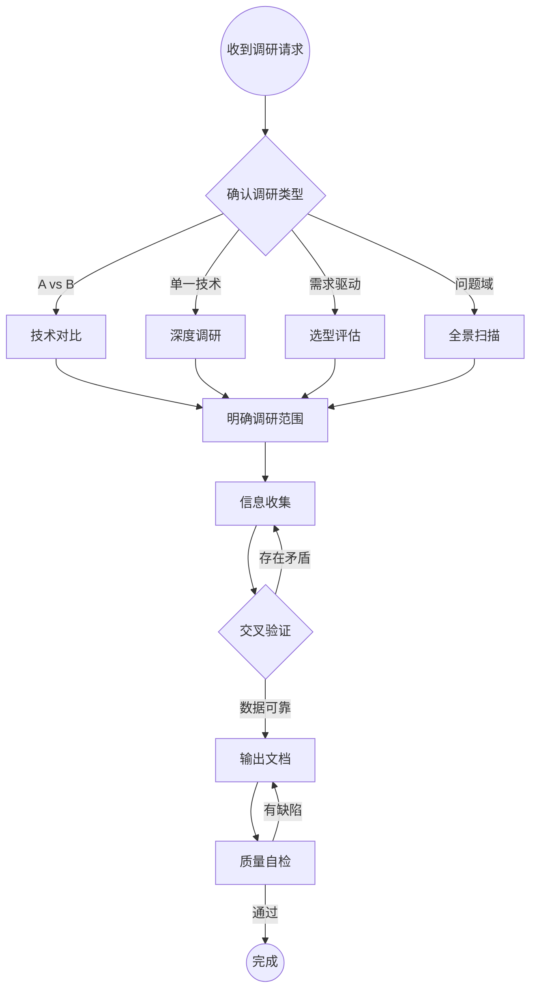

# 技术调研

系统化完成技术调研，输出结构化中文文档。

## 工作流程

## Step 1: 确认调研类型

用 AskQuestion 向用户确认调研模式（若请求已明确暗示类型则跳过）：

| 模式 | 适用场景 | 示例 |
|------|----------|------|
| **技术对比** | 两项或多项技术横向对比 | MySQL vs TDSQL、React vs Vue |
| **深度调研** | 单一技术的原理/架构/使用方式 | 深入研究 ClickHouse 架构 |
| **选型评估** | 面向具体需求，评估技术是否适合引入 | 我们该不该用 Kafka？ |
| **全景扫描** | 某个问题域有哪些可选方案 | 消息队列有哪些选择？ |

## Step 2: 明确调研范围

向用户确认以下信息（已知的可跳过）：

- **调研主题**：具体技术名称或问题域
- **覆盖维度**（默认全选）：架构与原理、性能与基准、功能特性、安全性、部署与运维、社区与生态、成本、学习曲线、适用场景
- **调研深度**：快速概览（1-2页） vs 深度分析（完整报告）
- **特殊关注点**：用户特别关心的方面

## Step 3: 信息收集

使用 WebSearch 和 WebFetch 系统收集信息，按来源优先级排序：

**一级来源（最高优先级）**：
- 官方文档、技术规范、API 参考

**二级来源**：
- GitHub 仓库（Stars、commits、issues）
- 行业标准文档（OWASP、NIST 等）

**三级来源**：
- 技术博客、行业分析、benchmark 报告
- 安全公告、CVE 记录

**四级来源（辅助验证）**：
- 社区讨论（Stack Overflow、Reddit、知乎）
- GitHub Issues / Discussions

**收集原则**：
- 用当前年份限定搜索，确保时效性
- 中英文关键词都搜，扩大覆盖面
- 每个关键结论至少 2-3 个来源交叉验证
- 发现矛盾信息时，标注分歧并追溯原因

## Step 4: 输出文档

根据调研类型从 [templates.md](templates.md) 选择对应模板，生成文档保存到 `docs/` 目录。

**文件命名**：
| 类型 | 命名规则 |
|------|----------|
| 技术对比 | `docs/<techA>-vs-<techB>.md` |
| 深度调研 | `docs/<tech>-deep-dive.md` |
| 选型评估 | `docs/<tech>-evaluation.md` |
| 全景扫描 | `docs/<domain>-landscape.md` |

## Step 5: 质量自检

文档输出后，必须对照以下清单自检，不通过则修正后重新检查：

### 完整性
- [ ] 所有调研问题都已回答
- [ ] 每个维度至少参考了 2-3 个来源
- [ ] 优势和劣势都有覆盖，无明显偏向
- [ ] 已识别并记录知识盲区

### 准确性
- [ ] 来源权威且时效性好（标注了日期）
- [ ] 矛盾信息已标注并说明
- [ ] 关键数据已交叉验证
- [ ] 假设和推测已明确标注

### 可操作性
- [ ] 结论可直接指导决策
- [ ] 风险已量化或分级
- [ ] 提供了替代方案
- [ ] 决策依据清晰

## 信心评级

对文档中的每个关键结论标注信心等级：

| 等级 | 范围 | 标准 | 标记方式 |
|------|------|------|----------|
| **高** | 90-100% | 多个权威来源一致，广泛采用 | 直接陈述 |
| **中** | 60-89% | 有文档支持，部分采用，存在小分歧 | 标注"据 X 和 Y 报告" |
| **低** | 30-59% | 来源有限，信息冲突 | 标注"信息有限，仅供参考" |
| **推测** | <30% | 基于推断，无直接来源 | 标注"推测性结论" |

## 文档风格要求

- **语言**：默认中文
- **善用表格**：对比信息优先用 markdown 表格
- **架构图**：用 mermaid 或文本流程图
- **数据来源**：所有关键数据标注来源和时间
- **客观中立**：陈述事实，推荐基于场景而非绝对优劣
- **文档头**：每篇必须包含更新时间和数据来源
- **知识盲区**：坦诚标注尚未查明的部分，不编造数据

## 调研反模式（避免）

| 反模式 | 正确做法 |
|--------|----------|
| 依赖单一来源下结论 | 每个结论至少 2-3 个来源交叉验证 |
| 只列优点不提缺点 | 优劣势均衡覆盖 |
| 使用过时数据 | 验证信息时效，标注日期 |
| 给出模糊推荐 | 结合场景给出明确、可操作的建议 |
| 忽略信心水平 | 对不确定的结论标注信心等级 |

## 参考资料

- 完整输出模板：[templates.md](templates.md)
