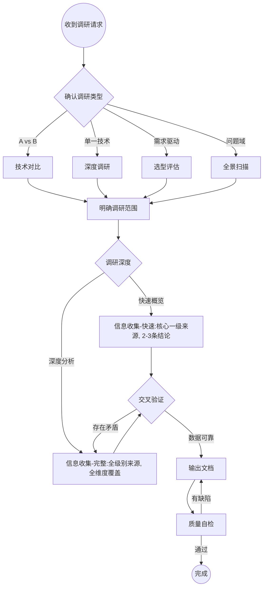

# 技术调研

系统化完成技术调研，输出结构化中文文档。

> 本 skill 依赖的所有子文件均位于本目录下，引用统一使用 `./xxx.md` 形式，迁移时整目录复制即可保持引用关系。
>
> - 输出模板：[./templates.md](./templates.md)
> - 信息源与时效性指引：[./sources.md](./sources.md)
> - 质量自检与信心评级：[./quality-check.md](./quality-check.md)

## 工作流程

## Step 1: 确认调研类型

用 AskQuestion 向用户确认调研模式（若请求已明确暗示类型则跳过）：

| 模式 | 适用场景 | 示例 |
|------|----------|------|
| **技术对比** | 两项或多项技术横向对比 | MySQL vs TDSQL、React vs Vue |
| **深度调研** | 单一技术的原理/架构/使用方式 | 深入研究 ClickHouse 架构 |
| **选型评估** | 面向具体需求，评估技术是否适合引入 | 我们该不该用 Kafka？ |
| **全景扫描** | 某个问题域有哪些可选方案 | 消息队列有哪些选择？ |

## Step 2: 明确调研范围

向用户确认以下信息（已知的可跳过）：

- **调研主题**：具体技术名称或问题域
- **覆盖维度**（默认全选）：架构与原理、性能与基准、功能特性、安全性、部署与运维、社区与生态、成本、学习曲线、适用场景
- **调研深度**：快速概览 vs 深度分析（两种模式的硬性差异见下表）
- **特殊关注点**：用户特别关心的方面

### 快速 vs 深度 模式的硬性差异

| 维度 | 快速概览 | 深度分析 |
|------|----------|----------|
| 来源数（每个关键结论） | ≥ 1 个一级来源 | ≥ 2-3 个跨级别来源交叉验证 |
| 维度覆盖 | 核心 3 个维度（架构/特性/适用场景） | 全部 9 个维度全覆盖 |
| 自检清单 | 仅跑"完整性"清单 | 完整性 + 准确性 + 可操作性 三类全跑 |
| 信心评级 | 关键结论必标注 | 所有结论必标注 |
| 篇幅 | 1-2 页 | 不设上限 |
| 适用场景 | 用户需快速决策、技术常识补齐 | 立项调研、技术选型报告 |

## Step 3: 信息收集

使用 WebSearch 和 WebFetch 系统收集信息。

**详细的来源优先级、推荐搜索顺序、饱和停止条件、时效性阈值见 [./sources.md](./sources.md)。**

**核心原则**：
- 中英文关键词都搜，扩大覆盖面
- 每个关键结论至少 2-3 个来源交叉验证（快速模式可放宽至 1 个一级来源）
- 发现矛盾信息时，标注分歧并追溯原因

## Step 4: 输出文档

根据调研类型从 [./templates.md](./templates.md) 选择对应模板，生成文档保存到 `docs/` 目录。

**文件命名**：

| 类型 | 命名规则 |
|------|----------|
| 技术对比 | `docs/<techA>-vs-<techB>.md` |
| 深度调研 | `docs/<tech>-deep-dive.md` |
| 选型评估 | `docs/<tech>-evaluation.md` |
| 全景扫描 | `docs/<domain>-landscape.md` |

## Step 5: 质量自检

文档输出后，必须对照 [./quality-check.md](./quality-check.md) 的清单完成自检：

- **完整性 / 准确性 / 可操作性** 三类清单（快速模式仅跑完整性）
- **信心评级与自检联动规则**：低/推测性结论会自动触发自检不通过

不通过则修正后重新检查。

## 文档风格要求

- **语言**：默认中文
- **善用表格**：对比信息优先用 markdown 表格
- **架构图**：用 mermaid 或文本流程图
- **数据来源**：所有关键数据标注来源和时间
- **客观中立**：陈述事实，推荐基于场景而非绝对优劣
- **文档头**：每篇必须包含更新时间和数据来源
- **知识盲区**：坦诚标注尚未查明的部分，不编造数据

## 调研反模式（避免）

| 反模式 | 正确做法 |
|--------|----------|
| 依赖单一来源下结论 | 每个结论至少 2-3 个来源交叉验证（快速模式 ≥ 1 个一级来源） |
| 只列优点不提缺点 | 优劣势均衡覆盖 |
| 使用过时数据 | 验证信息时效，按 [./sources.md](./sources.md) 时效性阈值标注 |
| 给出模糊推荐 | 结合场景给出明确、可操作的建议 |
| 忽略信心水平 | 对不确定的结论标注信心等级 |

## 参考资料

- 输出模板：[./templates.md](./templates.md)
- 信息源指引：[./sources.md](./sources.md)
- 质量自检：[./quality-check.md](./quality-check.md)
